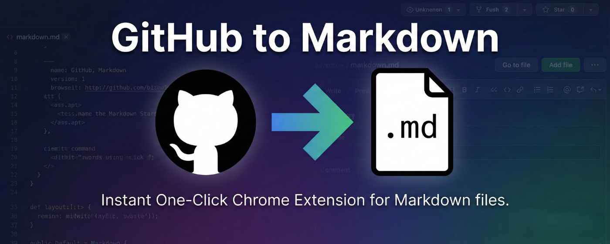
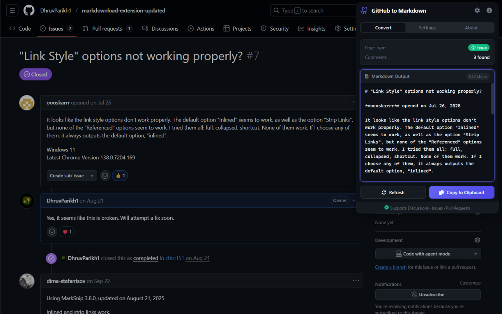
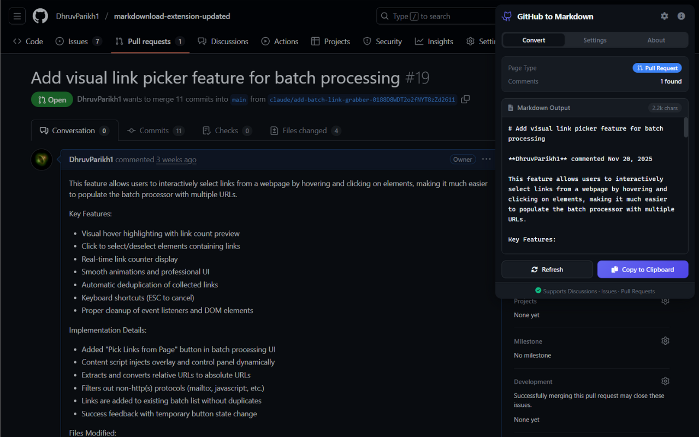
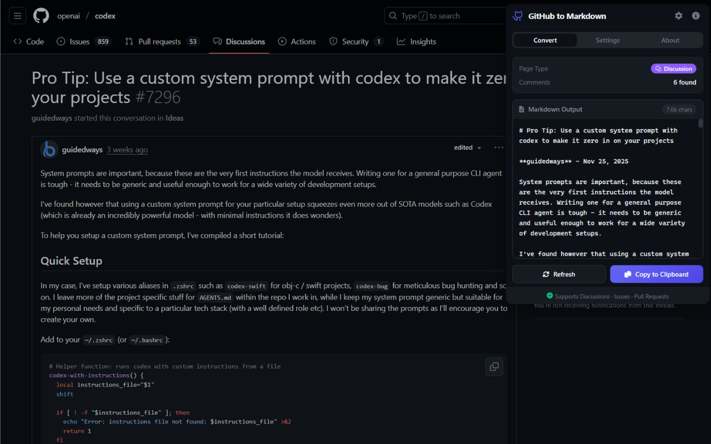

# [GitHub to Markdown](https://chromewebstore.google.com/detail/github-to-markdown/kfnipnnadmdamceblgihdhapecimabmk)

[](https://chromewebstore.google.com/detail/github-to-markdown/kfnipnnadmdamceblgihdhapecimabmk)

A Chrome extension that converts GitHub discussions, issues, and pull requests to clean, copyable markdown with one click.

## Screenshots

| Issues | Pull Requests | Discussions |
|:------:|:-------------:|:-----------:|
|  |  |  |

## Features

- **One-click conversion** - Convert any GitHub discussion, issue, or PR to markdown instantly
- **Preserves formatting** - Maintains code blocks, lists, headers, links, and more
- **Nested replies** - Properly indents nested comment threads
- **Configurable** - Toggle timestamps, bot comments, and event verbosity
- **Export options** - Presets, frontmatter copy, and `.md` download
- **Power tools** - Optional keyboard shortcut and context menu quick copy
- **Dark mode** - Automatically matches your system theme

## Installation

### Load Unpacked (Developer Mode)

1. Download or clone this repository
2. Open Chrome and navigate to `chrome://extensions/`
3. Enable **Developer mode** (toggle in top right)
4. Click **Load unpacked**
5. Select the `github-to-markdown` folder
6. The extension icon should appear in your toolbar

## Usage

### Using the Popup

1. Navigate to any GitHub discussion, issue, or pull request page
2. Click the extension icon in your toolbar
3. The markdown will automatically be extracted and displayed
4. Click **Copy to Clipboard** to copy the markdown
5. Paste anywhere you need it!

### Using the Page Button

1. Navigate to any GitHub discussion, issue, or pull request page
2. Look for the **Copy as Markdown** button near the header
3. Click it to copy the content directly to your clipboard

## Settings

- **Include timestamps** - Toggle to show/hide comment timestamps
- **Include nested replies** - Toggle to show/hide nested reply threads
- **Include bot comments** - Include/exclude bot-authored comments
- **Event verbosity** - `Full`, `Important only`, or `Comments only`
- **Keyboard shortcut** - Enable/disable quick copy via `Ctrl/Cmd+Shift+M`
- **Context menu** - Enable/disable right-click quick copy action

### Event Verbosity Modes

- **Full**
  Includes comments plus timeline events.
  Issue pages include events like labels and title changes.
  PR pages include commit/reference timeline entries and merge/check details.
- **Important only**
  Includes comments plus high-signal timeline events.
  Issue pages keep title changes and skip label churn.
  PR pages keep merge summary and skip commit/reference noise.
- **Comments only**
  Exports comments only and hides timeline events.

## Supported Conversions

| GitHub Element | Markdown Output |
|----------------|-----------------|
| Code blocks    | ` ```code``` `  |
| Inline code    | `` `code` ``    |
| Bold text      | `**bold**`      |
| Italic text    | `_italic_`      |
| Headers        | `# ## ### ...`  |
| Lists          | `- item` / `1. item` |
| Links          | `[text](url)`   |
| Blockquotes    | `> quote`       |
| Images         | ``   |
| Videos         | `[Video](url)`  |
| Details        | `<details>...`  |
| Toggle         | `<summary>...`  |

## Example Output

```markdown
**username** (Author) - Dec 13, 2025

This is the main discussion content with **bold** and `code`.

  **reply-user** - Dec 13, 2025

  This is a nested reply that gets indented.

---

**another-user** - Dec 13, 2025

Another top-level comment.

---
```

## Current Limitations

This extension currently supports **GitHub Discussions, Issues, and Pull Requests**. The following are planned for future releases:

- [x] GitHub Discussions
- [x] GitHub Issues
- [x] Pull Requests (Commits, Comments, Merge Info)
- [ ] Release notes

## Troubleshooting

### Extension not working?

1. Make sure you're on a supported GitHub page (URL should contain `/discussions/`, `/issues/`, or `/pull/`)
2. Try refreshing the GitHub page
3. Reopen the extension popup

### "Refresh the page" message?

The extension needs to be loaded when the page opens. Simply refresh the GitHub page and try again.

### Copy button disabled?

This means no markdown was found. Make sure you're on a valid GitHub page with content.

## Privacy

This extension:
- [x] Only runs on `github.com` and configured enterprise hosts
- [x] Never transmits any data
- [x] Processes everything locally
- [x] Requires minimal permissions

## Development

### Running Tests

The extension includes a test suite that validates the parser against reference examples:

```bash
cd github-to-markdown
npm install
npm test            # Run all tests
npm run test:pr     # Run PR tests only
npm run test:issue  # Run Issue tests only
```

Tests use real HTML examples to verify:
- Author name & timestamp extraction
- Markdown conversion (headers, code blocks, links, images)
- Nested reply handling
- Pull request elements (commits, merge info, checks)
- Error handling

### Packaging for Chrome Web Store

Create a production zip from the extension files:

```powershell
powershell -ExecutionPolicy Bypass -File .\scripts\package-extension.ps1
```

Or use npm:

```bash
npm run package
```

This creates:

- `dist/github-to-markdown-v<manifest-version>.zip`

The package includes only the files needed by the extension:

- `manifest.json`
- `background.js`
- `content.js`
- `parser.js`
- `injector.js`
- `popup/`
- `icons/`

## License

MIT License.

## Contributing

Issues and pull requests are welcome!
